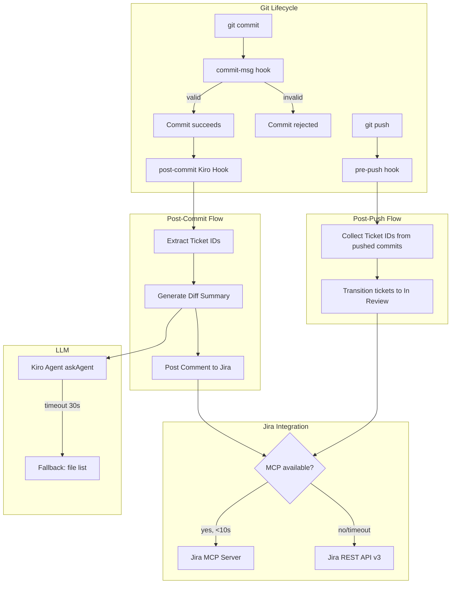

# Design Document: Jira Auto-Update

## Overview

The Jira Auto-Update system automatically keeps Jira tickets in sync with development activity by combining Git hooks with Kiro Agent Hooks. It operates at three distinct lifecycle points:

1. **Commit-msg (Git hook)** — Validates that every commit message contains a Jira ticket ID before the commit is finalized. This is a blocking, synchronous gate.
2. **Post-commit (Kiro Agent Hook)** — Generates an LLM-powered diff summary and posts it as a comment to the referenced Jira ticket(s). This is non-blocking.
3. **Post-push (Git pre-push hook)** — Transitions referenced Jira tickets to "In Review" status. This is non-blocking.

The system uses an MCP-first approach for Jira communication (10s timeout), falling back to REST API v3 with HTTP Basic Auth. LLM summarization leverages Kiro's built-in agent via askAgent invocation, with a map-reduce strategy for large diffs.

### Design Rationale

- **Comments on commit, status on push**: Incremental commits build context on the ticket without prematurely signaling "ready for review." Only an explicit push triggers the status transition.
- **MCP-first with REST fallback**: MCP provides a richer integration path when available; REST ensures the system works in all environments.
- **Blocking validation, non-blocking updates**: Commit validation must block to enforce traceability. Jira/LLM operations must never block the developer workflow after a successful commit.

## Architecture



### Technology Stack

| Layer | Technology | Rationale |
|-------|-----------|-----------|
| Commit-msg hook | Bash script | Zero dependencies, fast execution, runs before Node.js is needed |
| Post-commit logic | TypeScript (Node.js) | Rich error handling, async operations, type safety for Jira API |
| Pre-push hook | Bash script calling TypeScript | Needs to parse push refs and collect commit SHAs |
| LLM Summarization | Kiro Agent (askAgent) | Built-in, no external API keys required |
| Jira Communication | MCP client / axios | MCP-first, REST fallback |
| Configuration | dotenv | Standard .env file handling |

## Components and Interfaces

### 1. Commit Validator (`hooks/commit-msg`)

A bash script installed as a Git `commit-msg` hook.

```typescript
// Interface (conceptual — implemented in bash)
interface CommitValidator {
  // Reads the commit message file, validates ticket ID presence
  // Exit 0 = allow, Exit 1 = reject
  validate(commitMsgFile: string): ExitCode;
}
```

**Behavior:**
- Reads the commit message from the file path passed by Git (`$1`)
- Applies regex `/\b[A-Z][A-Z0-9]+-\d+\b/` to the full message content
- On match: exits 0 (commit proceeds)
- On no match: prints error to stderr with format example, exits 1

### 2. Ticket ID Extractor (`src/ticket-extractor.ts`)

```typescript
interface TicketExtractor {
  extract(commitMessage: string): string[];
}

// Returns deduplicated ticket IDs in order of first appearance, max 5
// Logs warning if more than 5 are found
```

**Behavior:**
- Applies regex globally to extract all matches
- Deduplicates preserving first-occurrence order
- Caps at 5 IDs, logs warning for overflow via Logger

### 3. LLM Summarizer (`src/llm-summarizer.ts`)

```typescript
interface LLMSummarizer {
  summarize(input: SummaryInput): Promise<string>;
}

interface SummaryInput {
  diff: string;          // output of git show <sha> --no-color
  commitMessage: string;
  changedFiles: string[];
}

// Returns: 2-4 sentence plain-text summary
// Throws: TimeoutError after 30s
```

**Behavior:**
- For small diffs (within context window): single LLM call
- For large diffs: map phase summarizes each file's diff, reduce phase combines into 2-4 sentence summary
- 30-second timeout; on timeout, throws to trigger fallback
- Prompt constrains output to information directly present in the diff/commit message

### 4. Jira Client (`src/jira-client.ts`)

```typescript
interface JiraClient {
  postComment(ticketId: string, comment: string): Promise<void>;
  transitionTo(ticketId: string, statusName: string): Promise<void>;
}

interface JiraConfig {
  baseUrl: string;
  email: string;
  apiToken: string;
  mcpTimeout: number; // 10000ms
}
```

**Behavior:**
- `postComment`: Posts ADF or wiki-markup formatted comment
- `transitionTo`: Looks up available transitions, matches by name (case-insensitive), executes transition
- Both methods: MCP-first with 10s timeout, then REST fallback
- Retry logic: 1 retry with 2s backoff for 5xx/network errors; no retry for 401/403/404

### 5. Configuration Loader (`src/config.ts`)

```typescript
interface Config {
  jiraBaseUrl: string;
  jiraEmail: string;
  jiraApiToken: string;
  mcpTimeout: number;
  llmTimeout: number;
}

interface ConfigLoader {
  load(): Config | ConfigError;
}

type ConfigError = {
  missingFields: string[];
  envFileNotGitignored?: boolean;
};
```

**Behavior:**
- Checks environment variables first (JIRA_BASE_URL, JIRA_EMAIL, JIRA_API_TOKEN)
- Falls back to `.env` file if env vars are missing
- Validates `.env` is in `.gitignore` before reading
- Returns error object listing missing fields if incomplete

### 6. Logger (`src/logger.ts`)

```typescript
interface Logger {
  info(ticketId: string, message: string): void;    // stdout
  warn(ticketId: string, message: string): void;    // stderr
  error(ticketId: string, message: string): void;   // stderr
}
```

**Behavior:**
- All output prefixed with `[jira-hook]`
- `info` → stdout, `warn`/`error` → stderr
- Never logs credentials or tokens

### 7. Post-Commit Orchestrator (`src/post-commit.ts`)

```typescript
interface PostCommitOrchestrator {
  run(commitSha: string): Promise<void>;
}
```

**Behavior:**
1. Loads config (bail if missing credentials)
2. Gets commit message via `git log -1 --format=%B <sha>`
3. Extracts ticket IDs
4. Gets diff via `git show <sha> --no-color`
5. Generates LLM summary (with fallback to file list on timeout)
6. Posts comment to each ticket (up to 5)
7. Logs per-ticket outcome

### 8. Post-Push Orchestrator (`src/post-push.ts`)

```typescript
interface PostPushOrchestrator {
  run(localRef: string, localSha: string, remoteRef: string, remoteSha: string): Promise<void>;
}
```

**Behavior:**
1. Loads config (bail if missing credentials)
2. Collects commits in the push range: `git log <remote-sha>..<local-sha> --format=%B`
3. Extracts and deduplicates all ticket IDs from all commit messages
4. Transitions each ticket to "In Review" (skips if already there or transition unavailable)
5. Logs per-ticket outcome

## Data Models

### Commit Context

```typescript
interface CommitContext {
  sha: string;           // full 40-char SHA
  shortSha: string;      // first 7 characters
  message: string;       // full commit message
  diff: string;          // git show output
  changedFiles: string[];
  ticketIds: string[];   // extracted, deduplicated, max 5
}
```

### Jira Comment Format

```
🤖 Auto-summary from commit <short-sha>:
<diff-summary text>
```

When LLM fallback is triggered:
```
🤖 Auto-summary from commit <short-sha>:
Changed files: <file1>, <file2>, ...
```

### Jira Transition Lookup Response

```typescript
interface JiraTransition {
  id: string;
  name: string;
  to: {
    name: string;
    id: string;
  };
}

// GET /rest/api/3/issue/{issueKey}/transitions
interface TransitionsResponse {
  transitions: JiraTransition[];
}
```

### Configuration Sources (Priority Order)

| Source | Priority | Condition |
|--------|----------|-----------|
| Environment variables | 1 (highest) | Always checked first |
| `.env` file | 2 | Only if env vars missing AND file is in `.gitignore` |

### Error Categories

```typescript
type JiraErrorCategory =
  | 'AUTH_ERROR'       // 401/403 — no retry
  | 'NOT_FOUND'       // 404 — log warning, skip
  | 'SERVER_ERROR'    // 5xx — retry once
  | 'NETWORK_ERROR'   // timeout/connection — retry once
  | 'MCP_TIMEOUT';    // MCP didn't respond in 10s — fallback to REST

type LLMErrorCategory =
  | 'TIMEOUT'         // >30s — fallback to file list
  | 'FAILURE';        // other error — fallback to file list
```


## Correctness Properties

*A property is a characteristic or behavior that should hold true across all valid executions of a system — essentially, a formal statement about what the system should do. Properties serve as the bridge between human-readable specifications and machine-verifiable correctness guarantees.*

### Property 1: Commit message validation is equivalent to regex match

*For any* string `s`, the Commit Validator accepts `s` (exit code 0) if and only if `s` contains at least one substring matching `/\b[A-Z][A-Z0-9]+-\d+\b/`. The position of the match within the string (subject line, body, anywhere) shall not affect the result.

**Validates: Requirements 1.1, 1.3, 1.4, 1.5**

### Property 2: Ticket ID extraction produces deduplicated, order-preserving, capped results

*For any* commit message containing N distinct ticket IDs (where ticket IDs match `/\b[A-Z][A-Z0-9]+-\d+\b/`), the extractor shall return a list of `min(N, 5)` unique IDs in order of first appearance, with no duplicates regardless of how many times each ID appears in the message.

**Validates: Requirements 2.1, 2.4**

### Property 3: Multi-commit ticket collection produces correct union

*For any* set of commit messages in a push range, the post-push orchestrator shall produce a deduplicated set of ticket IDs equal to the union of all ticket IDs extracted individually from each commit message (each capped at 5 per message).

**Validates: Requirements 4.2**

### Property 4: Transition name matching is case-insensitive

*For any* list of Jira transitions and any target status string, the transition matcher shall select a transition whose name equals the target when compared case-insensitively, returning the first match in list order.

**Validates: Requirements 4.3**

### Property 5: Comment formatting preserves structure

*For any* 7-character hex string (short SHA) and any non-empty summary text, the formatted comment shall equal the string `🤖 Auto-summary from commit <short-sha>:\n<summary>` with no Markdown syntax present.

**Validates: Requirements 5.2**

### Property 6: Environment variable precedence over .env file

*For any* pair of configuration values where both an environment variable and a `.env` file entry provide a value for the same key, the configuration loader shall always return the environment variable value.

**Validates: Requirements 6.2**

### Property 7: Missing credentials are reported accurately

*For any* subset of the required credential keys `{JIRA_API_TOKEN, JIRA_EMAIL, JIRA_BASE_URL}` that are absent from both environment variables and the .env file, the configuration loader shall report an error listing exactly those missing keys (no more, no fewer).

**Validates: Requirements 6.4**

### Property 8: Credentials never appear in log output

*For any* operation execution with configured credentials, no log message (stdout or stderr) shall contain the literal value of JIRA_API_TOKEN, JIRA_EMAIL password portion, or any substring of the API token longer than 4 characters.

**Validates: Requirements 6.7**

### Property 9: Retryable errors trigger exactly one retry with backoff

*For any* Jira API call that fails with a 5xx status code or network error, the Jira Client shall retry the operation exactly once after a delay of at least 2 seconds. For 401 or 403 responses, no retry shall be attempted.

**Validates: Requirements 7.2, 7.6**

### Property 10: LLM timeout fallback produces file list comment

*For any* commit with a set of changed files, when the LLM does not respond within 30 seconds, the system shall produce a comment that contains every filename from the changed files list.

**Validates: Requirements 7.4**

### Property 11: All log messages carry the [jira-hook] prefix

*For any* log output produced by the Hook System (info, warn, or error), the message shall start with the prefix `[jira-hook]`.

**Validates: Requirements 8.4**

### Property 12: Non-success log messages include ticket ID, operation, and reason

*For any* warning or error log event, the log message shall contain the Ticket ID that triggered the event, the name of the operation that produced the warning or error, and the reason it was skipped or failed.

**Validates: Requirements 8.2, 8.3**

### Property 13: Per-ticket logging for multi-ticket commits

*For any* commit message containing K distinct ticket IDs (1 ≤ K ≤ 5), the Hook System shall produce exactly K separate status log messages, one per ticket ID, each indicating that ticket's individual outcome.

**Validates: Requirements 8.5**

### Property 14: Large diff triggers map-reduce summarization

*For any* diff whose character length exceeds the configured context window threshold, the LLM Summarizer shall invoke the map phase (per-file summaries) followed by the reduce phase (combined summary), rather than a single LLM call.

**Validates: Requirements 3.3**

## Error Handling

### Strategy Overview

The system follows a **fail-open** philosophy after the commit-msg validation gate. Once a commit succeeds, no subsequent failure (LLM, Jira, network) shall block the developer or revert the commit.

### Error Handling by Component

| Component | Error Type | Behavior |
|-----------|-----------|----------|
| Commit Validator | No ticket ID found | Block commit (exit 1), print error to stderr |
| Config Loader | Missing credentials | Log error listing missing keys, skip all Jira operations |
| Config Loader | .env not in .gitignore | Refuse to read .env, log warning, skip Jira operations |
| Jira Client (MCP) | Timeout (>10s) | Fall back to REST API |
| Jira Client (MCP) | Connection error | Fall back to REST API |
| Jira Client (REST) | 401/403 | Log auth error, no retry, exit gracefully |
| Jira Client (REST) | 404 | Log warning with ticket ID, skip ticket, continue with others |
| Jira Client (REST) | 5xx | Retry once after 2s backoff |
| Jira Client (REST) | Network timeout | Retry once after 2s backoff |
| Jira Client (REST) | Retry exhausted | Log failure, exit gracefully (exit 0) |
| Jira Client | Transition not available | Log warning, skip status change |
| LLM Summarizer | Timeout (>30s) | Fall back to file-list-only comment |
| LLM Summarizer | Any other failure | Fall back to file-list-only comment |
| Post-Commit Hook | Any unhandled exception | Catch at top level, log error, exit 0 |
| Post-Push Hook | Any unhandled exception | Catch at top level, log error, exit 0 |

### Retry Policy

```typescript
const RETRY_CONFIG = {
  maxRetries: 1,
  backoffMs: 2000,
  retryableStatuses: [500, 502, 503, 504],
  retryableErrors: ['ECONNREFUSED', 'ETIMEDOUT', 'ECONNRESET', 'EAI_AGAIN'],
  nonRetryableStatuses: [401, 403, 404],
};
```

### Graceful Degradation Chain

```
Full operation → MCP timeout → REST fallback → REST retry → Log & exit 0
LLM call → LLM timeout → File list fallback → Post minimal comment
```

## Testing Strategy

### Unit Tests (Example-Based)

Unit tests verify specific behaviors and edge cases:

| Test Area | Examples |
|-----------|----------|
| Commit validation | Merge commit handling (1.6), error message format (1.2) |
| Config loading | Env var loading (6.1), .env fallback (6.5, 6.6) |
| Jira operations | MCP-first ordering (6.5), no transition on commit (4.7) |
| Edge cases | 404 handling (7.1), already "In Review" (4.5), multiple matching transitions (4.6), auth error no-retry (7.6), retry exhaustion (7.3) |
| Logging | Success message format (8.1), no Markdown in comments (5.3) |

### Property-Based Tests

Property-based testing (PBT) verifies universal correctness properties across generated inputs.

**Library:** [fast-check](https://github.com/dubzzz/fast-check) (TypeScript)

**Configuration:**
- Minimum 100 iterations per property test
- Each test tagged with: `Feature: jira-auto-update, Property {N}: {title}`

| Property | Generator Strategy |
|----------|-------------------|
| P1: Validation equivalence | Generate arbitrary strings; separately generate strings with injected valid ticket IDs |
| P2: Extraction dedup/cap | Generate messages with 1-10 ticket IDs, some duplicated, varying positions |
| P3: Multi-commit collection | Generate arrays of 1-20 commit messages with overlapping IDs |
| P4: Case-insensitive match | Generate transition lists with random-cased "In Review" variants |
| P5: Comment formatting | Generate random 7-char hex strings and multi-line summary texts |
| P6: Env var precedence | Generate random key-value pairs for both env and file sources |
| P7: Missing credential reporting | Generate random subsets of required keys as "present" |
| P8: No credential leakage | Generate random token strings, run operations, scan all output |
| P9: Retry behavior | Generate 5xx codes and network error types |
| P10: LLM fallback | Generate random file path lists of varying lengths |
| P11: Prefix presence | Invoke all log methods with random inputs, verify prefix |
| P12: Error log format | Generate random ticket IDs, operations, and reasons |
| P13: Per-ticket logging | Generate messages with 1-5 ticket IDs, verify log count |
| P14: Map-reduce threshold | Generate diffs of varying sizes around the threshold |

### Integration Tests

Integration tests verify end-to-end flows with mocked external services:

1. **Happy path**: Commit with ticket ID → LLM summary → Jira comment posted
2. **Push flow**: Push with tickets → status transitioned to "In Review"
3. **MCP fallback**: MCP times out → REST is used successfully
4. **LLM fallback**: LLM times out → file list comment posted
5. **Multi-ticket**: Commit with 3 ticket IDs → all 3 get comments
6. **Credential validation**: No credentials → all Jira operations skipped gracefully

### Test Directory Structure

```
tests/
├── unit/
│   ├── commit-validator.test.ts
│   ├── ticket-extractor.test.ts
│   ├── config-loader.test.ts
│   ├── jira-client.test.ts
│   ├── llm-summarizer.test.ts
│   └── logger.test.ts
├── property/
│   ├── validation.property.test.ts
│   ├── extraction.property.test.ts
│   ├── formatting.property.test.ts
│   ├── config.property.test.ts
│   ├── retry.property.test.ts
│   └── logging.property.test.ts
└── integration/
    ├── post-commit-flow.test.ts
    └── post-push-flow.test.ts
```
